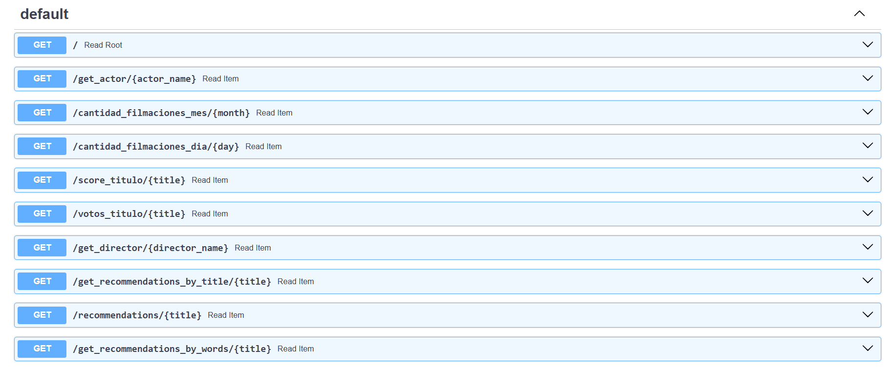

# API-Movies

 

**`Pre Requisitos`**: 

+ Instalación de:
+ Python
+ VSCode
+ GIT
+ PostMan

>> Cuenta activa en GitHub: https://github.com/
>> Cuenta activa en render: https://dashboard.render.com/

**`Librerias`**: 

A su ves tener las siguientes librerias de python instaladas:

+ numpy: Libreria requerida para las operaciones
+ matplotlib: Libreria para gráficar
+ pandas: libreria requerida para manipulación data
+ json: libreria requerida para manejo de columnas de tipo json
+ re: Libreria para el manejo de las expresiones regulares
+ fastapi: Libreria requerida crear los servicios rest

El código se encuentra en esta ruta:
https://github.com/deliamontoya/API-Movies

**`Operaciones Desplegadas`**: 

+ def **cantidad_filmaciones_mes( *`Mes`* )**:
    Se ingresa un mes en idioma Español. Debe devolver la cantidad de películas que fueron estrenadas en el mes consultado en la totalidad del dataset.

&nbsp;&nbsp;&nbsp;&nbsp;&nbsp;&nbsp;&nbsp;&nbsp;&nbsp;&nbsp;&nbsp;&nbsp;&nbsp;&nbsp;&nbsp;&nbsp;&nbsp;&nbsp;&nbsp;&nbsp;Ejemplo de retorno: *`X` cantidad de películas fueron estrenadas en el mes de `X`*
         

+ def **cantidad_filmaciones_dia( *`Dia`* )**:
    Se ingresa un día en idioma Español. Debe devolver la cantidad de películas que fueron estrenadas en día consultado en la totalidad del dataset.

&nbsp;&nbsp;&nbsp;&nbsp;&nbsp;&nbsp;&nbsp;&nbsp;&nbsp;&nbsp;&nbsp;&nbsp;&nbsp;&nbsp;&nbsp;&nbsp;&nbsp;&nbsp;&nbsp;&nbsp;Ejemplo de retorno: *`X` cantidad de películas fueron estrenadas en los días `X`*

+ def **score_titulo( *`titulo_de_la_filmación`* )**:
    Se ingresa el título de una filmación esperando como respuesta el título, el año de estreno y el score.
    
&nbsp;&nbsp;&nbsp;&nbsp;&nbsp;&nbsp;&nbsp;&nbsp;&nbsp;&nbsp;&nbsp;&nbsp;&nbsp;&nbsp;&nbsp;&nbsp;&nbsp;&nbsp;&nbsp;&nbsp;Ejemplo de retorno: *La película `X` fue estrenada en el año `X` con un score/popularidad de `X`*

+ def **votos_titulo( *`titulo_de_la_filmación`* )**:
    Se ingresa el título de una filmación esperando como respuesta el título, la cantidad de votos y el valor promedio de las votaciones. La misma variable deberá de contar con al menos 2000 valoraciones, caso contrario, debemos contar con un mensaje avisando que no cumple esta condición y que por ende, no se devuelve ningun valor.
    
&nbsp;&nbsp;&nbsp;&nbsp;&nbsp;&nbsp;&nbsp;&nbsp;&nbsp;&nbsp;&nbsp;&nbsp;&nbsp;&nbsp;&nbsp;&nbsp;&nbsp;&nbsp;&nbsp;&nbsp;Ejemplo de retorno: *La película `X` fue estrenada en el año `X`. La misma cuenta con un total de `X` valoraciones, con un promedio de `X`*

+ def **get_actor( *`nombre_actor`* )**:
    Se ingresa el nombre de un actor que se encuentre dentro de un dataset debiendo devolver el éxito del mismo medido a través del retorno. Además, la cantidad de películas que en las que ha participado y el promedio de retorno. **La definición no deberá considerar directores.**
    
&nbsp;&nbsp;&nbsp;&nbsp;&nbsp;&nbsp;&nbsp;&nbsp;&nbsp;&nbsp;&nbsp;&nbsp;&nbsp;&nbsp;&nbsp;&nbsp;&nbsp;&nbsp;&nbsp;&nbsp;Ejemplo de retorno: *El actor `X` ha participado de `X` cantidad de filmaciones, el mismo ha conseguido un retorno de `X` con un promedio de `X` por filmación*

+ def **get_director( *`nombre_director`* )**:
    Se ingresa el nombre de un director que se encuentre dentro de un dataset debiendo devolver el éxito del mismo medido a través del retorno. Además, deberá devolver el nombre de cada película con la fecha de lanzamiento, retorno individual, costo y ganancia de la misma.

**`Sistema de recomendación`**: 

+ def **get_recomendacion_by_title( *`titulo`* )**:
    Se ingresa el nombre de una película y te recomienda las similares en una lista de 5 valores de acuerdo al titulo

+ def **recomendacion( *`titulo`* )**:
    Se ingresa el nombre de una película y te recomienda las similares en una lista de 5 valores de acuerdo al score

+ def **get_recomendacion_by_words( *`titulo`* )**:
    Se ingresa el nombre de una película y te recomienda las similares de acuerdo al overview, genero, etc
 

La ruta de los servicios desplegados para ser probados estan en render en la siguiente URL:

https://api-movies-kjx9.onrender.com

Dentro de docs: https://api-movies-kjx9.onrender.com/docs# puede ver los servicios que estan activos

**`Estructura del Código`**: 

+ funciones.ipynb
    En este archivo, se encuentran las funciones que se van a estar utilizando en las operaciones, en su mayoria son funcioenes que convierten a un json un string, transforman fechas, dan la traducción de ingles a español de algunos datos necesarios.

    A su ves tiene la funcionalidad de inicializar el dataSet

+ ETL.ipynb
    Se encarga de las operaciones que interactuan directamente con los datos, dando formato, limpieza y entrega de los mismos. Se encuentra la lógica de cada una de las operaciones y se encapsulan en clases. 
    + Actor: Tiene el numero de filmes, el nombre, retorno y promedio del mismo, asi como sus getters y setters
    + InfoFilm: Básicamente tiene información delme como : title, year_movie, popularity, valoraciones, promedio, retorno, fecha_lanzamiento, costo, ganancia    
    + Films: Es la clase que se encarga de toda la lógica de las operaciones, a si como interactuar entre las classes y el archivo de funciones

+ EDA.ipynb
    Este archivo, tiene la logica que se siguio para las recomendaciones, que datos fueron lo usados, asi como gráficas y compraciones, la limpieza de outliers etc.

+ Recommendation.ipynb
    Básicmanete es una clase que tiene toda la lógica del EDA, solo que esta esta encapsulando los valores y exponiendo métodos, lo que hace más sencillo el consumo de la clase por el API

+ main.py
    Este archivo py tiene la integración con FastAPI y el del lado a las clases de InfoFilm y Recommendation, expone lo servicios para ser utilizados.

 

